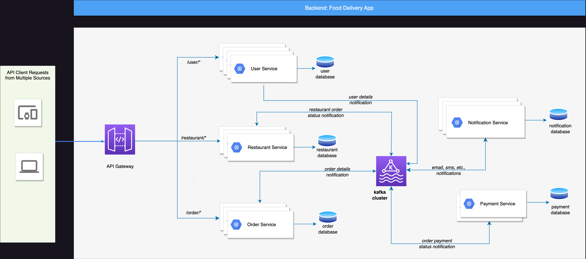

# food-delivery-backend

## Design Diagram

The backend of the food delivery application can be divided into several microservices to achieve scalability and maintainability.

## Components

### API Gateway
   
**Responsibility**: 
   
Acts as a single entry point for client requests and routes them to the appropriate microservices.
   
**Functionality:**

  - Authentication and authorization of incoming requests.
  - Request routing based on the requested service or functionality.
  - Load balancing for distributing traffic across multiple instances of microservices.
  - Error handling and response formatting for clients.

**Technology:** 

Spring Cloud Gateway or a similar API Gateway solution.

### User Service

**Responsibility:**

Manages user accounts and authentication.

**Functionality:**

- Handles user registration, login, and user profile management.
- Provides authentication and authorization for API access.

**Technology:**

Spring Boot with Spring Security.

### Restaurant Service

**Responsibility:** 

Manages restaurant-related data like menu items and other operations.
   
**Functionality:**

   - Provides APIs for listing all restaurants in the city.
   - Supports applying filters such as distance radius, opening hours, and cuisine.
   - Handles restaurant information storage and retrieval.
   - Stores and retrieves menu items for each restaurant.
   - Provides APIs for querying menu items.

**Technology:** 

Spring Boot with Spring Data JPA for data storage and Spring Web for APIs.

### Order Service

**Responsibility:** 
   
Handles the order management process.
   
**Functionality:**

   - Manages customer orders, including order placement, updates, and cancellations.
   - Communicates with restaurants for order processing.
   - Supports order tracking.
   - Handles asynchronous events using Kafka for order status updates.

**Technology:** 

Spring Boot, Kafka for event-driven communication.

### Payment Service

**Responsibility:** 
   
Manages billing and checkout processes.

**Functionality:**
   - Integrates with third-party payment gateways for payment processing.
   - Validates and processes payments for completed orders.
   
**Technology:** 

Spring Boot with payment gateway integration (e.g., Stripe or PayPal).

### Notification Service

   **Responsibility:** 
   
Handles communication between the application and users/restaurants.
  
   **Functionality:**

   - Sends notifications (e.g., email, SMS, push notifications) to users about order updates, promotions, etc.
   - Facilitates communication between users and restaurants (e.g., order confirmations, issue resolution).
   
**Technology:** Spring Boot with email/SMS/push notification integrations.

## Choice of Technologies

**Java 17:** Latest long-term support (LTS) version of Java.

**Spring Boot:** Simplifies building production-ready applications, with built-in features like Spring Web, Data JPA, Actuator, and more.

**MySQL 8:** A popular and reliable relational database for storing restaurant, menu, user, and order data.

**Kafka:** Used for asynchronous event-driven communication between microservices. For example, when an order is placed, it can trigger events to update order status and notify the user.

**Validation:** Spring Validation can be used to validate incoming requests.

**Lombok:** Simplifies Java code by reducing boilerplate code.

**Micrometer:** Helps with application metrics and tracing for monitoring.

**TestContainers, AssertJ, Awaitility, Rest Assured:** For testing and ensuring code quality.

## Application Packaging and Deployment
   
- Package each microservice as a Spring Boot embedded JAR for easy deployment.
- Use containerization (Docker) for each microservice for consistent deployment across different environments.
- Deploy microservices on a container orchestration platform like Kubernetes for scalability and reliability. 

## Considerations

- Implement a queuing mechanism (e.g., Kafka or RabbitMQ) to handle asynchronous tasks like order status updates and notifications.
- Implement rate limiting and security measures to protect against abuse.

## Limitations
   
**Scalability:** Depending on the application's growth, scaling may become a challenge. Use container orchestration to address this.
   
**Complexity:** Microservices architecture introduces complexity in terms of communication and management. Proper monitoring and logging are crucial.
