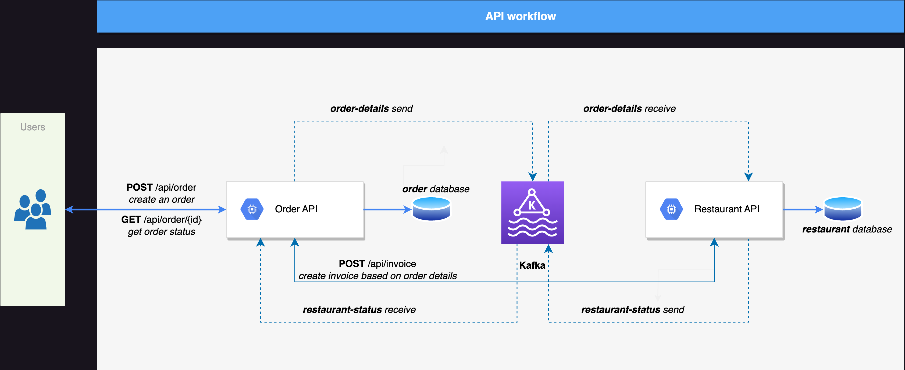
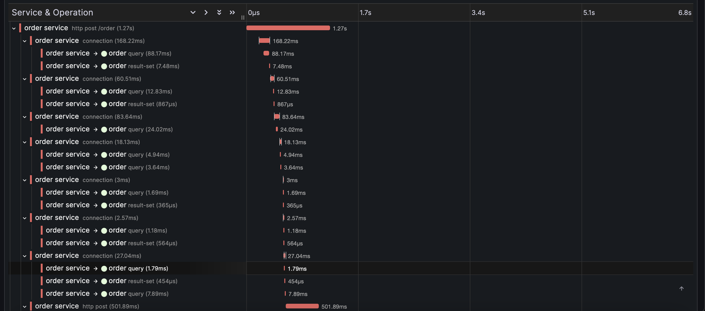
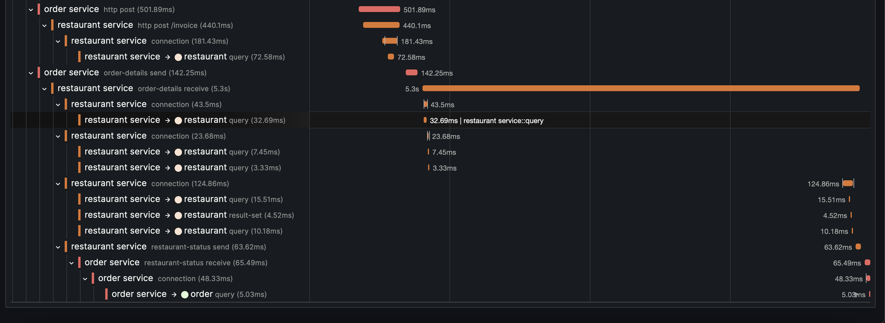

# food-delivery-backend


## How to run

### Pre-requisites

- Ensure that Docker is installed on your system.

### Run

1. Clone this project repository and navigate to it using your terminal or command prompt.

2. Move to the [docker](./docker) folder within the project directory.

3. Run the following command to start the Docker containers:
   ```
   docker compose up -d
   ```
4. Once the containers are up and running, you can access the different components of the application through the following URLs:

    1. You can perform the health check for the [order-api](./order) by visiting: http://localhost:8080/api/actuator/health.

    2. To perform the health check for the [restaurant-api](./restaurant), navigate to: http://localhost:8081/api/actuator/health.

    3. For database connection details please refer to the [docker compose](./docker/compose.yaml) file.

    4. Grafana, the monitoring tool, can be accessed at: http://localhost:3000
   
    5. To communicate with the `order-api`, you have the flexibility to utilize various REST clients, such as Postman. For this example, I've employed the JetBrains HTTP Client plugin. Simply navigate to the [http](./http) folder and access the [requests](./http/requests.http) file. Within this file, you'll find two distinct APIs available:

       1. **POST:** This endpoint is designed for the creation of new orders.

            _Sample Request_
            ```
            {
              "restaurant_id" : 1,
              "customer_id": 2,
              "delivery_address": "14 Avenue, SW, Calgary",
              "items" : [
                {
                  "item_id": 2,
                  "quantity": 5,
                  "notes": "NOTE-1"
                },
                {
                  "item_id": 3,
                  "quantity": 6,
                  "notes": "NOTE-2"
                }
              ]
            }
            ```
   
            _Sample Response_
   
            ```
            {
              "order_id": 1,
              "order_status": "PROCESSING",
              "billing_amount": 137.89,
              "timestamp": "2023-09-12T01:49:54.538437803Z"
            }
            ```
       
       2. **GET:** Use this endpoint to inquire about the current status of an order.

          _Sample Request_
            ```
            http://localhost:8080/api/order/status/1
            ```

          _Sample Response_

          ```
          {
             "order_id": 1,
             "order_status": "APPROVED"
          }
          ```
          
5. Please find the simple workflow of this project.


6. Here is a screenshot of Order API POST call. We can see what are all the operations (_DB, API and Kafka producer and consumer_) has been called between `order-api` and `restaurant-api`.




## Design Diagram

The backend of the food delivery application can be divided into several microservices to achieve scalability and maintainability.


## Components


### API Gateway
   
**Responsibility**: 
   
Acts as a single entry point for client requests and routes them to the appropriate microservices.
   
**Functionality:**

  - Authentication and authorization of incoming requests.
  - Request routing based on the requested service or functionality.
  - Load balancing for distributing traffic across multiple instances of microservices.
  - Error handling and response formatting for clients.

**Technology:** 

Spring Cloud Gateway or a similar API Gateway solution.


### User Service

**Responsibility:**

Manages user accounts and authentication.

**Functionality:**

- Handles user registration, login, and user profile management.

**Technology:**

Spring Boot with Spring Security.


### Restaurant Service

**Responsibility:** 

Manages restaurant-related data like menu items and other operations.
   
**Functionality:**

   - Provides APIs for listing all restaurants in the city.
   - Supports applying filters such as distance radius, opening hours, and cuisine.
   - Handles restaurant information storage and retrieval.
   - Stores and retrieves menu items for each restaurant.
   - Provides APIs for querying menu items.

**Technology:** 

Spring Boot with Spring Data JPA for data storage and Spring Web for APIs.


### Order Service

**Responsibility:** 
   
Handles the order management process.
   
**Functionality:**

   - Manages customer orders, including order placement, updates, and cancellations.
   - Communicates with restaurants for order processing.
   - Supports order tracking.
   - Handles asynchronous events using Kafka for order status updates.

**Technology:** 

Spring Boot, Web, Data JPA, Kafka for event-driven communication.


### Payment Service

**Responsibility:** 
   
Manages billing and checkout processes.

**Functionality:**
   - Integrates with third-party payment gateways for payment processing.
   - Validates and processes payments for completed orders.
   
**Technology:** 

Spring Boot with payment gateway integration (e.g., Stripe or PayPal).


### Notification Service

   **Responsibility:** 
   
Handles communication between the application and users/restaurants.
  
   **Functionality:**

   - Sends notifications (e.g., email, SMS, push notifications) to users about order updates, promotions, etc.
   - Facilitates communication between users and restaurants (e.g., order confirmations, issue resolution).
   
**Technology:** Kafka for event-driven communication and email/SMS/push notification integrations using AWS SNS.


## Choice of Technologies

**Java 17:** Latest long-term support (LTS) version of Java.

**Spring Boot:** Simplifies building production-ready applications, with built-in features like Spring Web, Data JPA, Actuator, and more.

**MySQL 8:** A popular and reliable relational database for storing data.

**Kafka:** Used for asynchronous event-driven communication between microservices. For example, when an order is placed, it can trigger events to update order status and notify the user.

**Validation:** Spring Validation can be used to validate incoming requests.

**Lombok:** Simplifies Java code by reducing boilerplate code.

**Micrometer:** Helps with application metrics and tracing for monitoring.

**TestContainers, AssertJ, Awaitility, Rest Assured:** For testing and ensuring code quality.


## Application Packaging and Deployment
   
- Package each microservice as a Spring Boot embedded JAR for easy deployment.
- Use containerization (Docker) for each microservice for consistent deployment across different environments.
- Deploy microservices on a container orchestration platform like Kubernetes for scalability and reliability. 


## Considerations

- Consider implementing a queuing mechanism (e.g., Kafka) to handle asynchronous tasks like order payment integration, user details update and other notifications.
- We could also implement rate limiting and security measures to protect against abuse.

## Limitations
   
**Scalability:** Depending on the application's growth, scaling may become a challenge. Use container orchestration to address this.
   
**Complexity:** Microservices architecture introduces complexity in terms of communication and management. Proper monitoring and logging are crucial.
